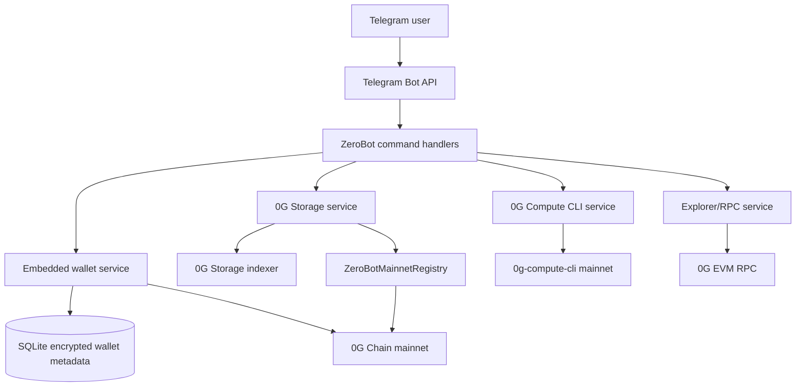

# ZeroBot

ZeroBot is a Telegram-native 0G mainnet agent wallet for storing files, discovering compute providers, and anchoring user actions on 0G Chain.

## Basic Project Information

Project name: **ZeroBot**

One-sentence description, under 30 words:

> Telegram-native 0G agent wallet for storage uploads, compute discovery, wallet operations, and contract-backed on-chain activity from chat.

Short summary:

ZeroBot turns Telegram into a practical control surface for the 0G mainnet stack. A user can create an embedded 0G wallet, check A0GI balance, upload files through the configured 0G Storage indexer, anchor storage roots to a deployed 0G Chain contract, inspect live 0G Compute providers through the compute CLI, and submit payable compute purchase intents to the same contract.

Problem solved:

0G is powerful, but normal users and hackathon judges usually have to jump between wallets, explorers, RPC calls, storage endpoints, and CLI tools to verify real usage. ZeroBot compresses those workflows into a Telegram interface and leaves verifiable 0G mainnet transactions behind.

0G components used:

| Component | Used | How ZeroBot uses it |
| --- | --- | --- |
| 0G Chain | Yes | Wallet balances, latest block lookup, transaction lookup, and payable contract calls on 0G mainnet. |
| 0G Storage | Yes | File uploads are sent to the configured storage indexer and returned roots are stored locally and anchored on-chain. |
| 0G Compute | Yes | Provider/model discovery uses the 0G Compute CLI on mainnet, and compute purchase intents are recorded by contract events. |
| Agent ID | No | Not claimed for this build. |
| Privacy / Secure Execution | No | Not claimed for this build. |

Prize track fit:

- **Track 1: Agentic Infrastructure & OpenClaw Lab** because ZeroBot is an agent-facing infrastructure layer for wallet, storage, and compute workflows.
- **Track 3: Agentic Economy & Autonomous Applications** because it provides a chat-native agent wallet and purchase-intent flow for 0G services.

## 0G Integration Proof

Mainnet contract address:

```text
0x3C1F34D1f93793Cc07747BE639A472C1e14f3f5f
```

Explorer links:

- Contract: <https://chainscan.0g.ai/address/0x3C1F34D1f93793Cc07747BE639A472C1e14f3f5f>
- Deployment transaction: <https://chainscan.0g.ai/tx/0x6f811b52c2b1a349e4f95e0cb2d94a875055f4ba3b1249a0e395eec2ed06cb18>

On-chain proof summary, under 300 characters:

```text
ZeroBot is deployed on 0G mainnet at 0x3C1F34D1f93793Cc07747BE639A472C1e14f3f5f. The bot calls purchaseCompute(...) for payable compute intents and anchorStorage(...) to record 0G Storage roots. Explorer: https://chainscan.0g.ai/address/0x3C1F34D1f93793Cc07747BE639A472C1e14f3f5f
```

Contract functions used by the bot:

| Function | Trigger | Purpose |
| --- | --- | --- |
| `purchaseCompute(string gpu,uint256 durationHours,string providerTag)` | `/buy_compute` confirmation | Records a payable compute purchase intent and emits `ComputePurchased`. |
| `anchorStorage(string rootHash,string fileName)` | After `/store` upload | Anchors a 0G Storage root and emits `StorageAnchored`. |
| `withdraw(address to,uint256 amount)` | Owner only | Allows the contract owner to withdraw accumulated payable intent funds. |

Events used as judge-verifiable evidence:

| Event | Evidence value |
| --- | --- |
| `ComputePurchased` | Shows buyer, GPU type, duration, provider tag, value, and timestamp. |
| `StorageAnchored` | Shows buyer, root hash, file name, and timestamp. |

## Progress During Hackathon

- Built a Telegram bot backend around `python-telegram-bot`, Web3.py, SQLite, and encrypted per-user wallets.
- Added `/commands` so users can list available actions without rerunning `/start`.
- Added 0G mainnet configuration for RPC, explorer, storage indexer, compute CLI, and contract address.
- Deployed `ZeroBotMainnetRegistry` to 0G mainnet and wired bot actions to its ABI.
- Added storage upload flow with root capture, local metadata persistence, and optional on-chain anchoring.
- Added compute provider/model discovery using the 0G Compute CLI with a runtime mainnet config.
- Moved deployment to a 24/7 VPS service with systemd after Render free-tier spin-down caused bot downtime.

## System Architecture



Technical description:

The bot runs as a Python backend process. Telegram commands enter through `bot/main.py`, which registers handler modules in `bot/handlers`. Wallets are created by Web3.py and encrypted before local SQLite persistence. Storage uploads go through the configured 0G Storage indexer, then the resulting root is stored locally and can be anchored to the deployed registry contract. Compute discovery shells out to the 0G Compute CLI after writing a mainnet config file. On-chain reads and writes use 0G mainnet RPC.

## Command Surface

| Command | Description |
| --- | --- |
| `/start` | Show the main overview and wallet state. |
| `/commands` | Show the available commands without rerunning onboarding. |
| `/help` | Show the main bot guide. |
| `/stack` | Show the configured 0G RPC, explorer, storage, compute, and contract endpoints. |
| `/connect` | Create or view the embedded 0G wallet. |
| `/balance` | Check the wallet's native A0GI balance. |
| `/portfolio` | Show a portfolio-style wallet summary. |
| `/store` | Upload a Telegram file to 0G Storage and anchor the root if possible. |
| `/retrieve <root_hash>` | Look up stored file metadata by root/hash. |
| `/files` | List files uploaded by the Telegram user. |
| `/compute_market` | List live 0G Compute mainnet providers through the CLI integration. |
| `/models` | List 0G Compute models through the CLI integration. |
| `/compute_account` | Show 0G Compute CLI network/account status. |
| `/buy_compute [gpu_type] [hours]` | Prepare and confirm a payable compute intent on 0G Chain. |
| `/job_status <job_id>` | Check a compute intent transaction status. |
| `/stake` | Show 0G staking information. |
| `/explorer` | Show latest 0G Chain block information. |
| `/tx <hash>` | Look up a 0G transaction by hash. |
| `/prices` | Show 0G market snapshot data. |
| `/alerts` | Show price-alert guidance. |

## Backend API Documentation

ZeroBot does not expose a public HTTP API for end users. Its backend API is the Telegram command interface plus internal service modules.

Internal service interfaces:

| Module | Key functions | Role |
| --- | --- | --- |
| `bot/services/wallet_service.py` | `get_or_create_user`, `get_private_key`, `get_balance` | Creates encrypted user wallets and reads balances. |
| `bot/services/chain_service.py` | `send_contract_transaction`, `send_native`, `get_transaction_receipt` | Sends 0G mainnet transactions and reads receipts. |
| `bot/services/storage_service.py` | `store_file`, `anchor_file_onchain`, `retrieve_file`, `list_files` | Uploads to 0G Storage, persists metadata, anchors storage roots. |
| `bot/services/compute_service.py` | `buy_compute`, `confirm_compute_purchase`, `get_job_status` | Builds and sends compute purchase intents to the 0G contract. |
| `bot/services/og_compute_cli.py` | `stack_summary`, `list_compute_providers`, `list_models`, `account_status` | Wraps 0G Compute CLI calls for provider/model discovery. |

Important environment variables:

| Variable | Purpose |
| --- | --- |
| `TELEGRAM_BOT_TOKEN` | Telegram bot token. |
| `WALLET_ENCRYPTION_KEY` | Fernet key used to encrypt wallet private keys in SQLite. |
| `DATABASE_PATH` | SQLite database path. |
| `OG_RPC_URL` | 0G mainnet RPC endpoint, default `https://evmrpc.0g.ai`. |
| `OG_CHAIN_ID` | 0G mainnet chain ID, default `16661`. |
| `OG_EXPLORER_URL` | 0G explorer base URL. |
| `OG_STORAGE_INDEXER` | 0G Storage indexer endpoint. |
| `OG_COMPUTE_CLI_BIN` | Preferred compute CLI binary, usually `0g-compute-cli`. |
| `OG_COMPUTE_CLI_RPC` | RPC used by the compute CLI. |
| `OG_COMPUTE_CLI_NETWORK` | Compute CLI network profile, `mainnet` in production. |
| `ZEROBOT_CONTRACT_ADDRESS` | Deployed `ZeroBotMainnetRegistry` address. |

## Tutorial: How the 0G Integration Works

1. A user sends `/connect`.
2. ZeroBot creates an embedded EVM wallet and stores the encrypted private key in SQLite.
3. The user funds that wallet with A0GI on 0G mainnet.
4. The user sends `/store`, then uploads a Telegram file.
5. `storage_service.store_file` posts the file to `OG_STORAGE_INDEXER`.
6. The bot stores the returned root or transaction hash in SQLite.
7. `storage_service.anchor_file_onchain` calls `anchorStorage(rootHash,fileName)` on `ZeroBotMainnetRegistry`.
8. The judge can verify the contract and event activity through the 0G explorer.
9. The user sends `/compute_market` or `/models`.
10. `og_compute_cli.py` calls the 0G Compute CLI against the configured mainnet RPC.
11. The user sends `/buy_compute A100 1` and confirms the inline action.
12. `compute_service.confirm_compute_purchase` sends a payable transaction to `purchaseCompute(...)`.

## Local Deployment and Reproduction

Prerequisites:

- Python 3.11 or newer
- Node.js 22 or newer for the 0G Compute CLI
- A Telegram bot token
- A Fernet encryption key
- A funded 0G mainnet wallet for testing paid actions

Install:

```bash
git clone https://github.com/TS-mfon/zerobot.git
cd zerobot
python3 -m venv .venv
. .venv/bin/activate
pip install -r requirements.txt
npm install -g @0glabs/0g-serving-broker
cp .env.example .env
python3 -c "from cryptography.fernet import Fernet; print(Fernet.generate_key().decode())"
```

Configure `.env`:

```env
TELEGRAM_BOT_TOKEN=replace_me
WALLET_ENCRYPTION_KEY=replace_with_generated_fernet_key
DATABASE_PATH=./data/zerobot.db
OG_RPC_URL=https://evmrpc.0g.ai
OG_CHAIN_ID=16661
OG_EXPLORER_URL=https://chainscan.0g.ai
OG_STORAGE_INDEXER=https://indexer-storage.0g.ai
OG_COMPUTE_CLI_BIN=0g-compute-cli
OG_COMPUTE_CLI_RPC=https://evmrpc.0g.ai
OG_COMPUTE_CLI_NETWORK=mainnet
ZEROBOT_CONTRACT_ADDRESS=0x3C1F34D1f93793Cc07747BE639A472C1e14f3f5f
```

Run locally:

```bash
python -m bot.main
```

Run with Docker:

```bash
docker build -t zerobot .
docker run --env-file .env zerobot
```

Production VPS service example:

```ini
[Unit]
Description=ZeroBot Telegram backend
After=network-online.target
Wants=network-online.target

[Service]
WorkingDirectory=/opt/bots/zerobot
EnvironmentFile=/opt/bots/zerobot/.env
ExecStart=/opt/bots/zerobot/.venv/bin/python -m bot.main
Restart=always
RestartSec=5

[Install]
WantedBy=multi-user.target
```

## Reviewer Notes and Test Account Guidance

- This is a mainnet integration, so the bot does not include a faucet command.
- A reviewer should run `/connect`, copy the generated wallet address, and fund it with enough A0GI for gas and payable purchase tests.
- Read-only flows that do not require funding: `/commands`, `/stack`, `/explorer`, `/prices`, `/compute_market`, `/models`.
- Funded flows: `/store` when anchoring is enabled, `/buy_compute`, and any action that sends a 0G Chain transaction.
- If 0G Storage indexer availability changes, the bot logs the storage response and still keeps local metadata for debugging.
- If the 0G Compute CLI is temporarily unavailable, `/compute_market` and `/models` surface the CLI error instead of silently returning fake data.

## User Testing Notes

Test scenarios completed or prepared for judges:

| Scenario | Steps | Expected result |
| --- | --- | --- |
| Onboarding | Send `/start`, then `/commands` | Bot returns overview and command list. |
| Wallet creation | Send `/connect` | Bot returns a 0G wallet address. |
| Balance check | Fund wallet, send `/balance` | Bot shows native A0GI balance from 0G RPC. |
| Storage upload | Send `/store`, attach a file | Bot uploads file, stores metadata, and anchors root if gas is available. |
| Storage retrieval | Send `/retrieve <root_hash>` | Bot returns stored file metadata. |
| Compute discovery | Send `/compute_market` and `/models` | Bot shows live 0G Compute CLI output. |
| Compute purchase | Send `/buy_compute A100 1`, confirm | Bot broadcasts a payable contract transaction. |
| Explorer verification | Open contract explorer link | Judge can inspect contract and emitted events. |

Known limitations:

- Compute purchase execution records a verifiable purchase intent. It does not provision a long-running GPU session by itself.
- Storage retrieval currently returns metadata and root references, not a full file download pipeline.
- Wallets are embedded for UX. Production hardening should add optional external wallet signing.

## Judging Criteria Alignment

0G Technical Integration Depth and Innovation:

- Uses 0G Chain, 0G Storage, and 0G Compute together in one Telegram agent workflow.
- Provides on-chain contract evidence instead of a concept-only demo.
- Bridges chat UX to infra-level operations that normally require CLI/RPC knowledge.

Technical Implementation and Completeness:

- Backend is deployed as a persistent service.
- Commands are registered with Telegram's command menu.
- Wallet, storage, compute, explorer, and contract modules are separated for maintainability.
- Contract source and ABI wiring are included in the repository.

Product Value and Market Potential:

- Makes 0G usable from a mobile chat interface.
- Targets builders, operators, and non-technical users who need fast storage/compute workflows.
- Can evolve into an agent wallet, ops console, or service marketplace.

User Experience and Demo Quality:

- `/commands` exposes available actions at any time.
- Inline confirmation is used before paid compute transactions.
- Explorer links and transaction hashes support clear demo verification.

Team Capability and Documentation:

- This README documents architecture, environment setup, contract proof, reproduction steps, and judge notes.
- The codebase shows meaningful backend, contract, and integration work.

## Repository

GitHub repository:

```text
https://github.com/TS-mfon/zerobot
```

Source layout:

| Path | Purpose |
| --- | --- |
| `bot/main.py` | Telegram application entrypoint and command registration. |
| `bot/handlers/` | Telegram command handlers. |
| `bot/services/` | Wallet, chain, storage, compute, explorer, and CLI integrations. |
| `bot/db/` | SQLite schema and database helpers. |
| `contracts/ZeroBotMainnetRegistry.sol` | 0G mainnet registry contract. |
| `Dockerfile` | Container deployment definition. |
| `.env.example` | Reviewer/deployment configuration template. |

## License

MIT
